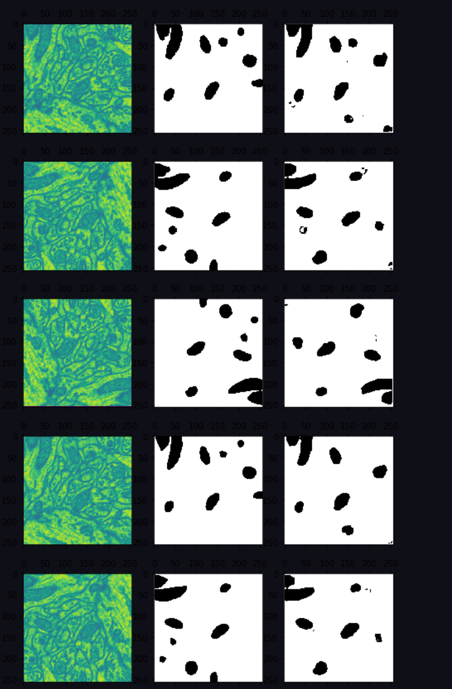

# 🧬 Mitochondria Detection in Electron Microscopy Images using U-Net

A deep learning project that uses the U-Net architecture to segment mitochondria in electron microscopy images. This model performs pixel-level classification to identify mitochondria from high-resolution cellular imagery.

---

## 🚀 Overview

This project trains a U-Net model in TensorFlow to detect mitochondria from biomedical image data. The pipeline includes image preprocessing, augmentation, model training, and prediction visualization — all implemented in a single Jupyter notebook.

---

## 🧠 Features

- Implements the **U-Net** model for biomedical image segmentation  
- Preprocesses images with normalization, flipping, and rotation  
- Trains the model using a labeled `.npz` dataset of mitochondria images  
- Visualizes prediction results using Matplotlib  
- Entire workflow is contained in: `Mitochondria_detection_using_Unet.ipynb`

---

## 🛠️ Tech Stack

- **Language:** Python  
- **Frameworks/Libraries:** TensorFlow, NumPy, Matplotlib  
- **Model Architecture:** U-Net ([jakeret/unet](https://github.com/jakeret/unet))  
- **Execution:** Jupyter Notebook

---

## 📊 Dataset

- Format: `mito.npz` (NumPy archive) containing images and segmentation masks  
- Preprocessing includes:
  - Resizing to `256x256`
  - Pixel normalization
  - Label conversion to foreground/background
  - Data augmentation (random flip & rotation)

---

## ⚙️ How to Run

1. Clone the repository:

    ```bash
    git clone https://github.com/your-username/Mitochondria-Detection-in-Electron-microscopy-images.git
    cd Mitochondria-Detection-in-Electron-microscopy-images
    ```

2. Install dependencies:

    ```bash
    pip install tensorflow numpy matplotlib
    pip install git+https://github.com/jakeret/unet.git
    ```

3. Open the notebook and run all cells:

    ```bash
    jupyter notebook Mitochondria_detection_using_Unet.ipynb
    ```

4. Upload the `mito.npz` dataset file when prompted.

---

## 📸 Sample Output

The image below shows predicted mitochondria regions produced by the trained U-Net model:




---

## 🧪 Future Improvements

- Apply denoising techniques before training to improve segmentation quality  
- Expand dataset and use additional augmentation strategies  
- Experiment with deeper U-Net variants and hyperparameter tuning

---
